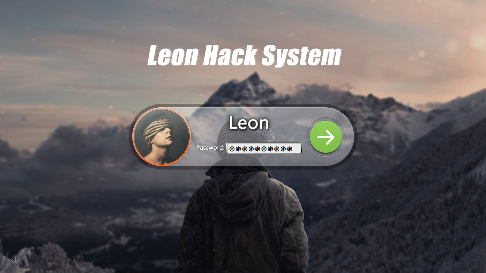
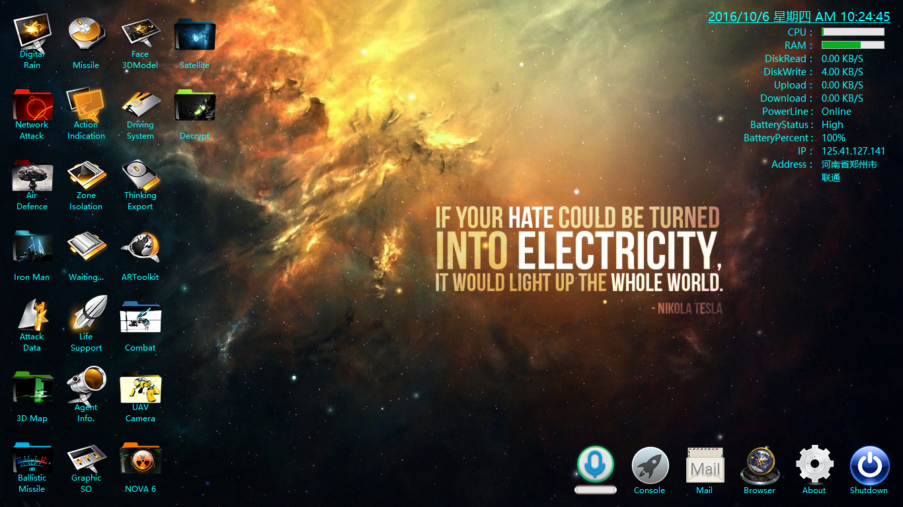
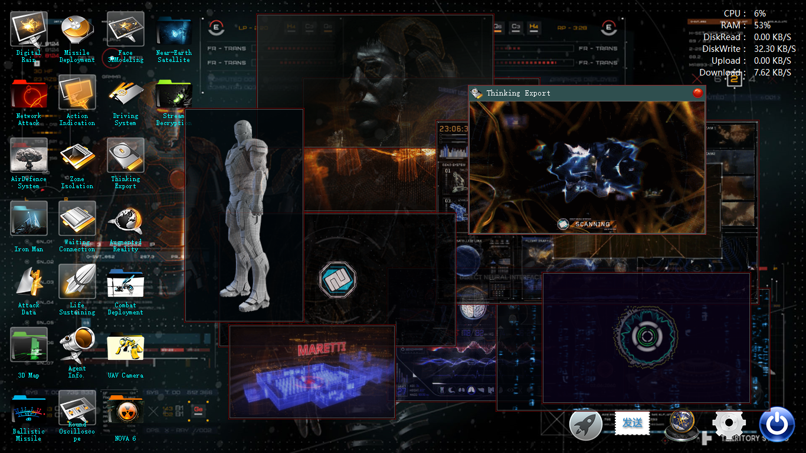
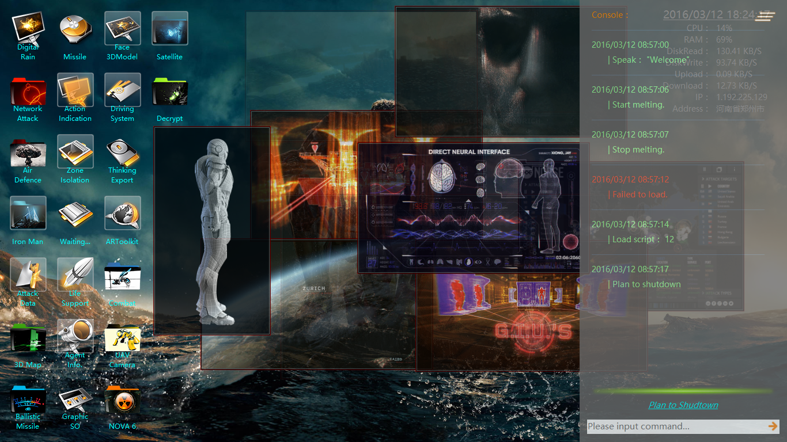
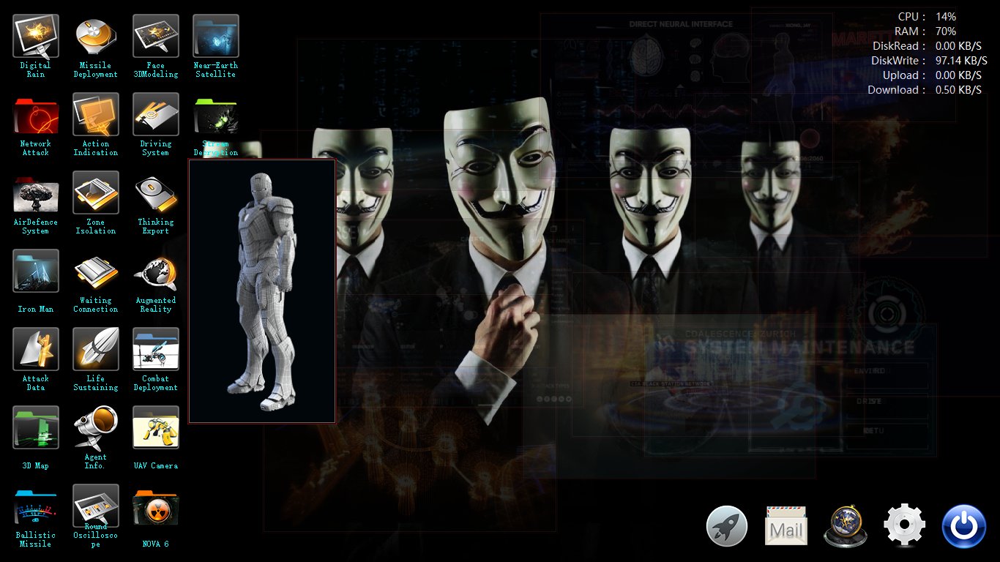
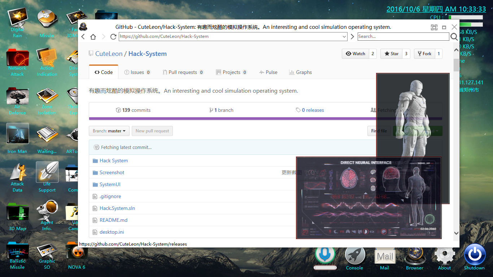
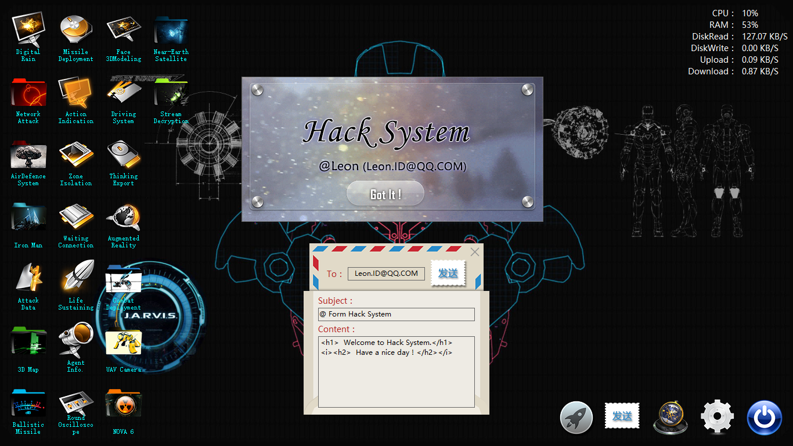
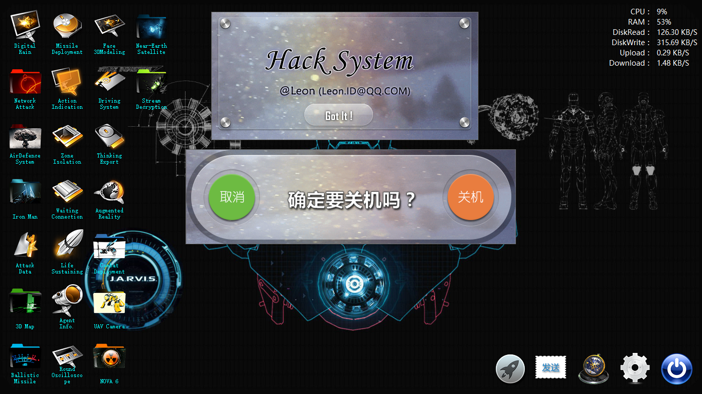
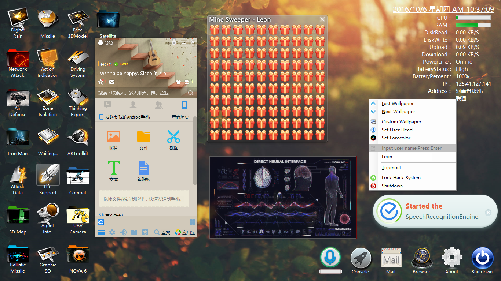
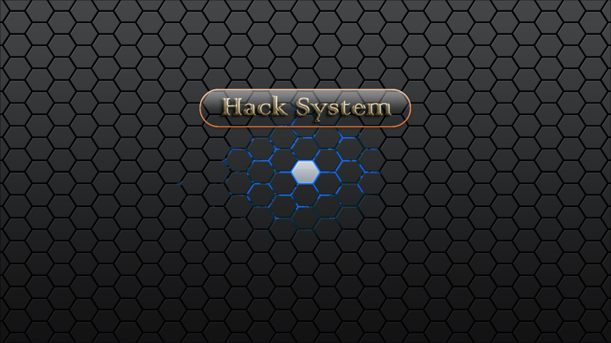

# Hack-System
### An interesting and cool simulation operating system.

> __Here are some Screenshots :__

* Hack System Starting Up.

___
* User Login.(You can login in whatever your password is ,just press [Enter].)

___
* The main desktop of Hack-System.

___
* The desktop full of scripts windows.

___
* Press [~] to call for the console.

___
* Make the mouse hover on the desktop icon and you will see the Aero-Peek mode.

___
* There is a browser inside.

___
* You can send E-Mail and see [About-Me].

___
* Ask you whether you are going to shutdown or not.

___
* Lock system.

___
* You can drag this window to margin of screen to hide it.

> __by: Leon.ID@QQ.COM__
