# Hack-System

#### An interesting and cool simulation operating system.
#### 这是一个有趣而炫酷的模拟操作系统。

#### 项目启动日期：2015/12/12

> ### __[<u>Hack-System 下载地址<u/>](https://raw.githubusercontent.com/CuteLeon/FileRepository/master/HackSystem-Execute/Hack%20System.exe)__

#####  [HackSystem] 为 [.Net-4.0] 编译版本，同时支持 Win-XP\Vista\7\8\10 系统
#####  需要安装 [<u>.Net Framework 4.0(点击下载)<u/>](https://raw.githubusercontent.com/CuteLeon/FileRepository/master/.Net%20Framework%20%204.0.exe)

> __附上一些截图：__

* HackSystem 启动界面。
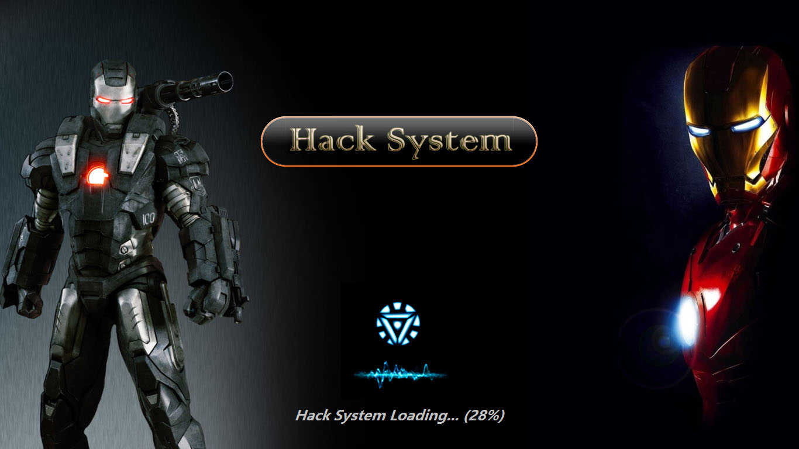
***
* HackSystem 用户登录和锁屏界面。
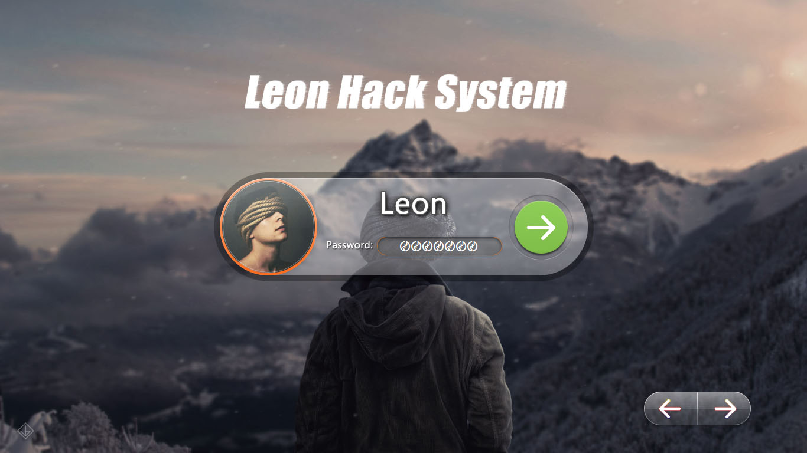
***
* HackSystem 主桌面。
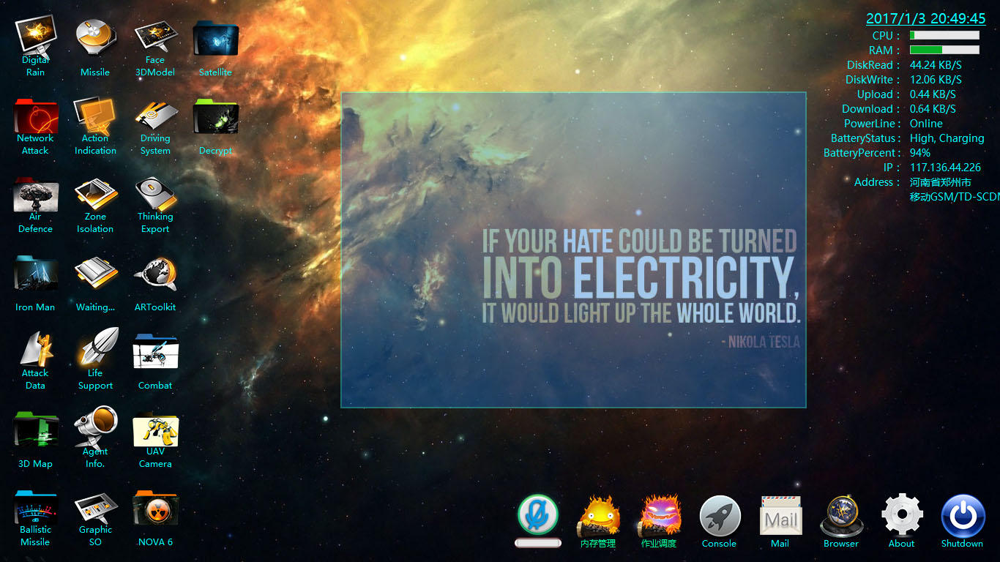
***
* HackSystem 充满了内置脚本窗口的桌面。
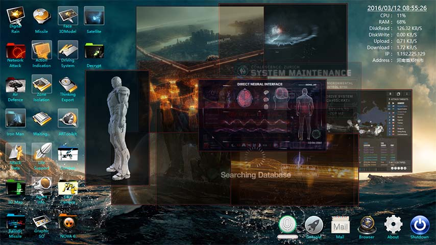
***
* HackSystem 按下 [~] 键呼出侧方控制台。

***
* HackSystem 鼠标悬停在桌面的图标上，你可以看到 Aero-Peek 预览视图。
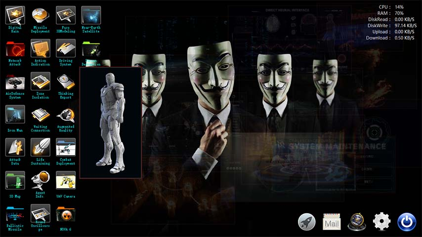
***
* HackSystem 内置的网络浏览器。
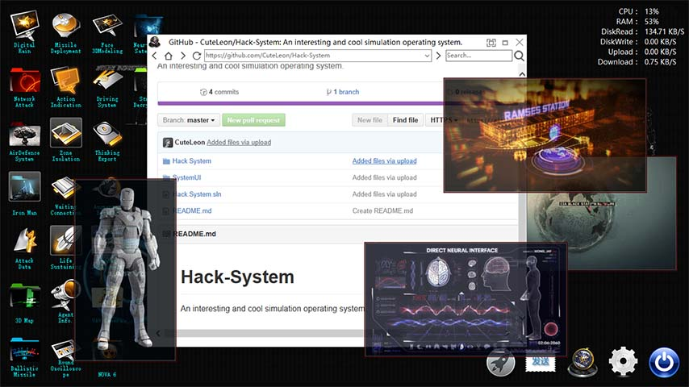
***
* HackSystem 你可以使用内置工具发送邮件(邮件内容支持超文本语言)和查看关于界面。
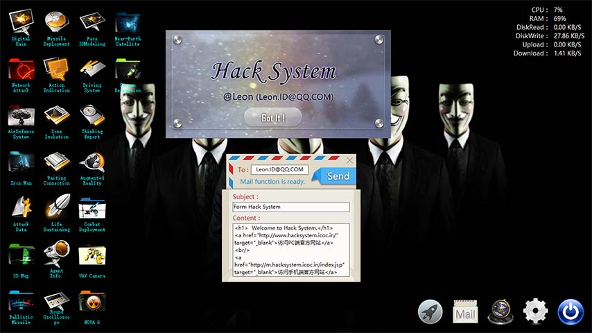
***
* HackSystem 关闭前的提示窗口。

***
* HackSystem 置后显示(嵌入到物理系统的桌面内)，你可以正常操作其他应用程序的窗口。
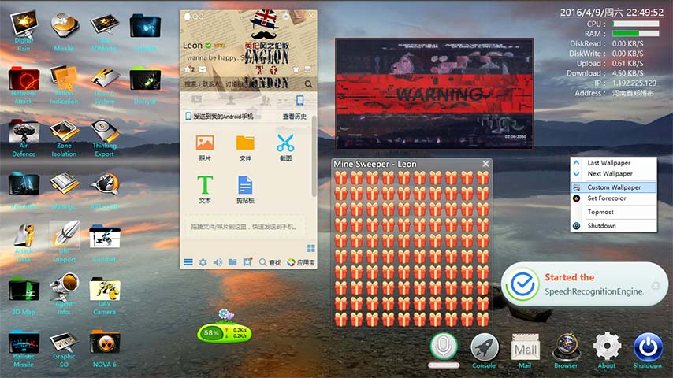
***
* HackSystem 内附带的1010和2048小游戏(上图的扫雷也是内置的)。
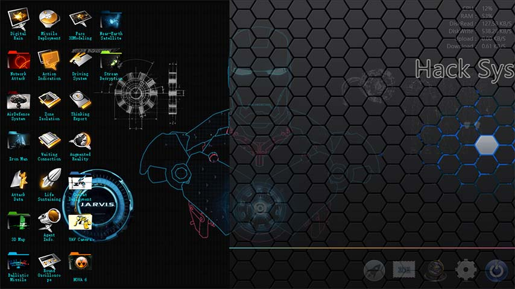
***
* HackSystem 关闭。
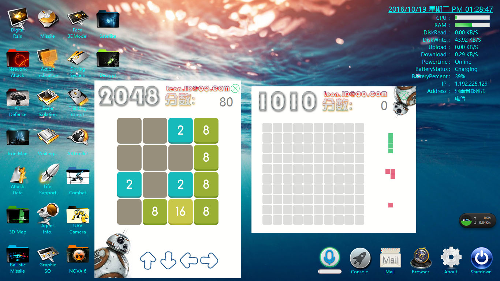
***
* HackSystem 检查更新。
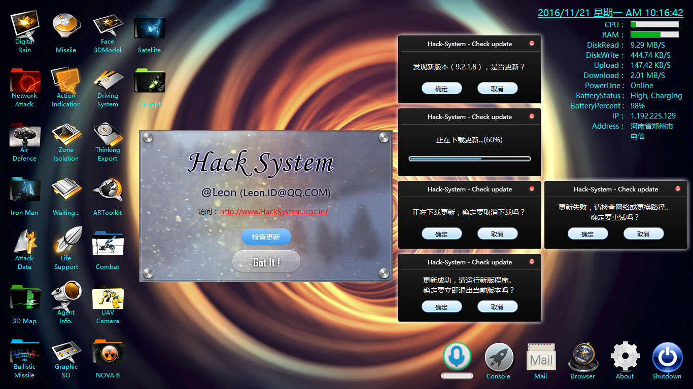

使用遵循 [<u>《知识共享署名-非商业性使用 4.0 国际许可协议》<u/>](https://creativecommons.org/licenses/by-nc/4.0/) 许可
> __BY: Leon.ID@QQ.COM__
